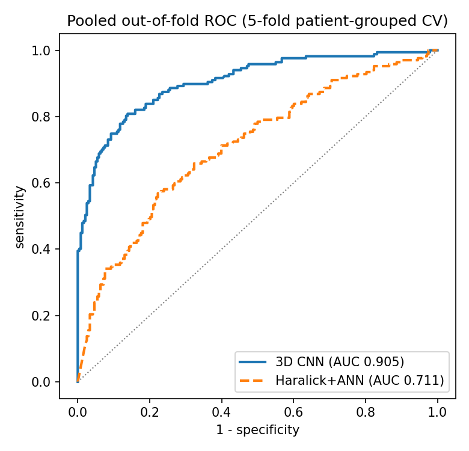
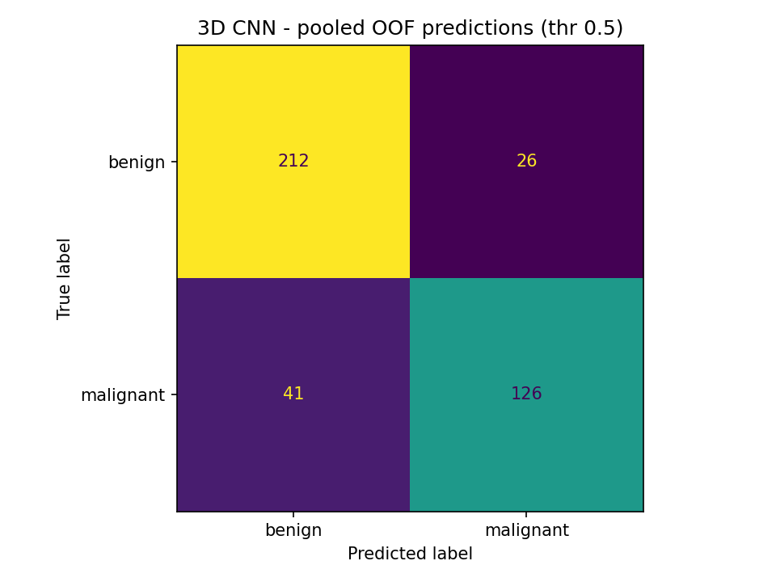
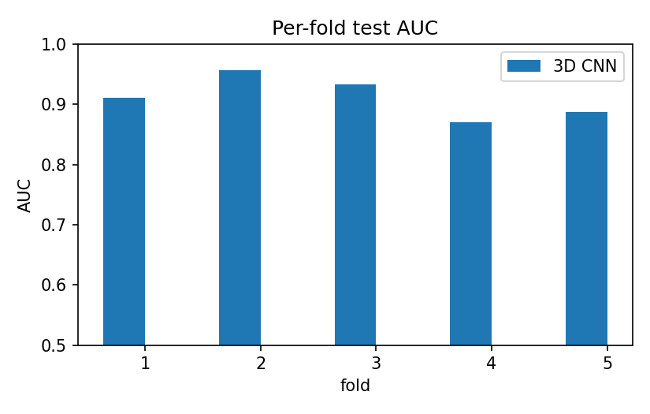
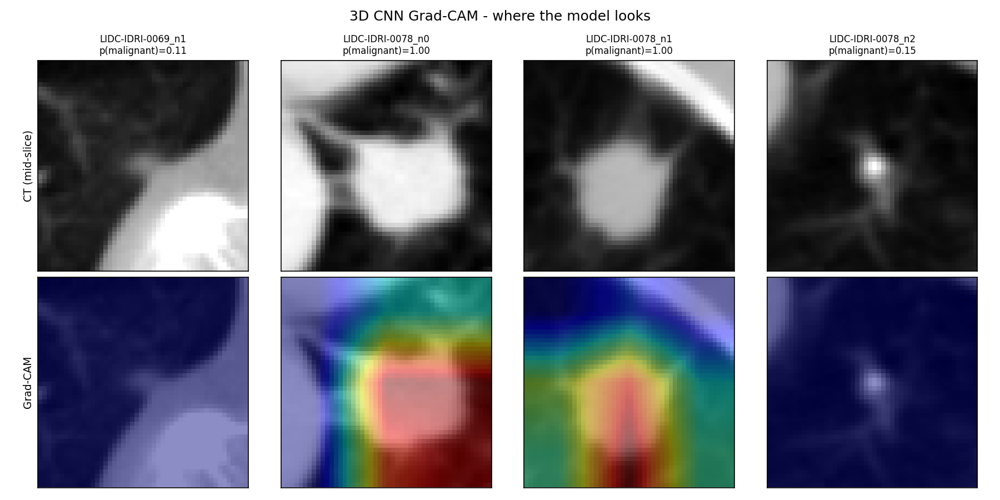

# Lung Nodule Malignancy — 3D CNN reimplementation

A modern, runnable reimplementation of the methodology published in:

> **Lung cancer detection system using lung CT image processing** — D. Tadvi, A. Kumbhar,
> R. Powar, A. Koli. *IJNRD*, Vol. 8, Issue 1, Jan 2023 (IJNRD2301211).

The 2023 paper used mathematical-morphology lung segmentation → Haar wavelet → GLCM /
Haralick texture features (252-D) → a 252-20-2 back-propagation ANN, on ~216 hospital
CT slices, reaching **92% test accuracy / 88.7% sensitivity / 97.1% specificity**.

This repo keeps the *problem* (binary benign-vs-malignant from CT) and rebuilds the
*pipeline* on the public **LIDC-IDRI** dataset with a **3D convolutional neural network**
that reasons over the whole nodule volume instead of hand-crafted 2D texture features.
The original method is re-implemented in [`src/baseline/haralick_ann.py`](src/baseline/haralick_ann.py)
so every result is reported **head-to-head, on the identical patient-safe split**.

---

## 1. What changed, and why (old paper → this repo)

| Stage | 2023 paper | This repo (2025/26) | Why it's better |
|---|---|---|---|
| Data | ~216 private hospital slices | LIDC-IDRI: 1018 scans / ~2600 nodules, public, radiologist-scored | Reproducible, citable, benchmarkable, ~10× data |
| Unit of analysis | one 2D axial slice | **3D patch** (40 mm cube, resampled to isotropic 64³ voxels) | A nodule is a volume; spiculation/lobulation live in 3D |
| Lung segmentation | morphological opening/closing, fixed disk SE size 15 | **not needed** — patches are nodule-centred from consensus annotations | The paper's own "future scope" blamed the fixed SE for its misclassifications |
| Features | Haar wavelet + GLCM + 7 Haralick features, 4 dirs, 3 scales → 252-D | **learned** by 3D conv layers end-to-end | No manual feature engineering; captures shape + texture + context jointly |
| Classifier | feed-forward ANN 252-20-2, back-prop | **3D ResNet-10/18** (~1–3M params), AdamW + cosine LR, mixed precision | Residual learning, batch-norm, augmentation, class balancing |
| Label | "cancerous / non-cancerous" (subjective) | median radiologist malignancy: `<3` benign, `>3` malignant, `==3` excluded | Standard, defensible LIDC convention |
| Eval | single split, accuracy + sens/spec | patient-grouped split, **AUC + sens/spec + F1**, ROC & confusion-matrix plots, Grad-CAM | No patient leakage; threshold-independent metric; explainability |
| Rigour | — | fixed seed, saved config, saved split, history CSV, smoke test | Anyone can reproduce your number |

### The "modern ideology" in one paragraph
Move from **hand-crafted 2D texture + shallow ANN** to **end-to-end volumetric representation
learning** with **honest evaluation** (patient-level splits, AUC, calibration) and
**explainability** (Grad-CAM). Optionally layer on **self-supervised pre-training** and
**CNN–Transformer hybrids** (see §3) as stretch goals.

---

## 2. Project layout

```
lung-nodule-3d/
├── config/default.yaml          # every hyper-parameter; override on CLI
├── src/
│   ├── config.py                # yaml + "--a.b.c value" overrides
│   ├── data/
│   │   ├── extract_patches.py    # raw LIDC DICOM ──pylidc──▶ 3D .npy patches + manifest.csv
│   │   ├── dataset.py            # torch Dataset + patient-safe train/val/test split
│   │   └── transforms.py         # HU windowing, 3D flips/rot/crop augmentation
│   ├── models/resnet3d.py        # ResNet3D-10 / -18
│   ├── engine/
│   │   ├── train.py              # training loop: AMP, cosine LR, class balance, early stop
│   │   └── evaluate.py           # metrics + ROC + confusion-matrix figures
│   ├── baseline/haralick_ann.py  # the ORIGINAL 2023 method, for the comparison table
│   └── utils/{metrics,seed,gradcam}.py
├── scripts/
│   ├── make_synthetic_data.py    # fake data so you can test the pipeline with no download
│   ├── 01_extract_patches.sh
│   └── 02_train.sh
├── notebooks/colab_train.ipynb   # ▶ run the whole thing on a free Colab T4
└── tests/test_smoke.py           # end-to-end run on synthetic data
```

Data flow: `raw DICOM ▶ extract_patches.py ▶ data/processed/{patches/*.npy, manifest.csv}
▶ train.py ▶ artifacts/<run>/{best.pt, history.csv, test_metrics.json, roc.png}`.

---

## 3. Reference papers (2023–2026) to cite and borrow from

**Core datasets / benchmarks**
- LUNA16 challenge (LIDC-IDRI subset, 888 scans) — the standard nodule-detection benchmark.
  <https://luna16.grand-challenge.org/Data/>
- `pylidc` — programmatic access to LIDC radiologist annotations (malignancy 1–5, contours).

**3D CNN nodule classification / false-positive reduction**
- *A deep 3D residual CNN for false-positive reduction in pulmonary nodule detection* —
  <https://pubmed.ncbi.nlm.nih.gov/29500816/> (the architecture family this repo follows)
- *3D multi-view CNNs for lung nodule classification* —
  <https://www.ncbi.nlm.nih.gov/pmc/articles/PMC5690636/>
- *Lung Nodule Classification Using Biomarkers, Volumetric Radiomics, and 3D CNNs* —
  <https://pmc.ncbi.nlm.nih.gov/articles/PMC8329152/>

**2025–2026 state of the art (stretch goals / "future work" section)**
- *Lung Nodule-SSM: Self-Supervised Lung Nodule Detection & Classification* (DINOv2 backbone,
  pre-train on unlabeled CT, fine-tune) — <https://arxiv.org/abs/2505.15120>
- *LMLCC-Net: semi-supervised malignancy prediction with Hounsfield-unit intensity filtering*
  (LIDC-IDRI) — <https://arxiv.org/pdf/2505.06370>
- *MAEMC-NET: hybrid self-supervised (masked auto-encoder + contrastive) for solitary
  pulmonary nodule malignancy* — <https://pmc.ncbi.nlm.nih.gov/articles/PMC11861088/>
- *A hybrid CNN + Transformer approach for lung cancer classification on CT* (2026) —
  <https://www.nature.com/articles/s41598-026-41161-7>
- *Hybrid CNN–Transformer with BM3D denoising + YOLOv8 for early detection in low-dose CT*
  (2026) — <https://www.nature.com/articles/s41598-026-43517-5>
- *LungCraft: hybrid 3D-2D deep learning + radiomics + explainable AI* (2026) —
  <https://www.frontiersin.org/journals/artificial-intelligence/articles/10.3389/frai.2026.1853361/full>
- *Binary classification of lung cancer using Vision Transformers on CT* (2026) —
  <https://link.springer.com/article/10.1007/s10791-026-09931-z>
- *CPLOYO: pulmonary nodule detection with multi-scale feature fusion* —
  <https://arxiv.org/pdf/2503.10045>

**Reference implementations to read**
- Project-MONAI tutorials (3D transforms, DenseNet/ResNet, sliding-window) —
  <https://github.com/Project-MONAI/tutorials>
- <https://github.com/Fazil-kagdi/lung-nodule-segmentation-classification> (pylidc + UNet + ResNet)
- <https://github.com/shartoo/luna16_multi_size_3dcnn> (multi-scale 3D CNN FP reduction)

---

## 4. Getting the data

You do **not** need your old hospital images. Pick one path:

### Path A — pre-extracted patches (fastest, recommended for limited compute)
Some LIDC nodule-crop datasets are published on Kaggle / Zenodo as `.npy` or `.npz`.
Drop them into `data/processed/` as `patches/<id>.npy` + a `manifest.csv` with columns
`patch_id, patient_id, malignancy, label, diameter_mm, source`. Then skip to §5.

### Path B — extract from raw LIDC-IDRI yourself (full control, ~125 GB DICOM)
1. Install the **NBIA Data Retriever** and download LIDC-IDRI from TCIA
   (<https://www.cancerimagingarchive.net/collection/lidc-idri/>). You can download a
   **subset** (e.g. first 200 patients ≈ 25 GB) to start.
2. Create `C:\Users\<you>\pylidc.conf` (Windows) or `~/.pylidcrc`:
   ```ini
   [dicom]
   path = D:\datasets\LIDC-IDRI
   warn = True
   ```
3. `python -m src.data.extract_patches --out data/processed --patch-mm 40 --patch-vox 64 --limit 200`

### Path C — LUNA16 `.mhd/.raw`
Smaller and already lung-segmented. You'd adapt `extract_patches.py` to read `.mhd` with
SimpleITK and use `annotations.csv` world coordinates. (Left as an extension.)

---

## 5. Running it

### 5.1 Local sanity check (no data, no GPU) — do this first
```bash
python -m venv .venv && .venv\Scripts\activate      # Windows
pip install -r requirements.txt
python scripts/make_synthetic_data.py --n 200 --patch-vox 64
python -m src.engine.train --train.epochs 3 --train.num_workers 0 --output.run_name smoke
python -m src.engine.evaluate --run artifacts/smoke
pytest -q                                            # or: python tests/test_smoke.py
```
This exercises the entire pipeline (dataset → 3D CNN → metrics → plots) on fake blobs.
The synthetic malignant class has spiculations, so val AUC should climb above ~0.8 in a
few epochs — that only proves the *plumbing* works.

### 5.2 Real training on Colab (free T4) — the main path
Open [`notebooks/colab_train.ipynb`](notebooks/colab_train.ipynb) → set runtime to **T4 GPU** → run cells.
```bash
# what the notebook runs:
python -m src.engine.train --train.epochs 60 --model.depth 18 \
    --data.patch_size 48 --output.run_name resnet3d_lidc
python -m src.baseline.haralick_ann
python -m src.engine.evaluate --run artifacts/resnet3d_lidc
```

### 5.3 Key knobs
| Want | Flag |
|---|---|
| Smaller GPU / OOM | `--train.batch_size 16 --data.patch_size 40 --model.depth 10` |
| Bigger GPU (A100/L4) | `--train.batch_size 64 --model.depth 18 --data.patch_size 56` |
| Faster epochs | `--model.widths "[16,24,32,64]"` |
| No class balancing | `--train.balance_classes false` |
| CPU-only run | `--train.amp false --train.num_workers 0` |

---

### 5.4 Windows: `OSError: [WinError 126] ... shm.dll`
PyTorch wheels need the **Microsoft Visual C++ Redistributable (x64)**. If `import torch`
fails with WinError 126 (missing `vcruntime140.dll`), install it once:
<https://aka.ms/vs/17/release/vc_redist.x64.exe>, reboot, then `pip install -r requirements.txt`
again. (This is the only local blocker on a fresh Windows box; Colab/Kaggle are unaffected.)

---

## 6. Running it when your machine can't (compute strategy)

Your CT-volume training is GPU + RAM bound. Options, cheapest first:

1. **Google Colab (free)** — T4 16 GB GPU, ~12 GB RAM, ~12 h sessions.
   Enough for ResNet3D-18 at 48³ patches, batch 32. Store `data/processed/` and
   `artifacts/` on **Google Drive** (mount it) so nothing is lost when the VM recycles.
   Checkpoints are written every epoch (`last.pt`), so you can resume.
2. **Colab Pro / Pro+ (~US$10–50/mo)** — L4 / A100 40 GB, 50 GB RAM, background execution,
   longer sessions. Use for `depth 18`, `patch_size 56`, batch 64.
3. **Kaggle Notebooks (free)** — 2× T4 (30 GB total) or P100, 30 h/week, 20 GB disk.
   LIDC and LUNA16 are hostable as Kaggle datasets → no download step. Good backup to Colab.
4. **Cloud VMs** — Lightning AI / Paperspace / RunPod / Vast.ai spot A10/A4000 ≈ US$0.2–0.4/h.
   `rsync` the repo, `pip install -r requirements.txt`, run `scripts/02_train.sh`.
5. **Local machine, shrunk to fit** — if you have *any* NVIDIA GPU: `depth 10`, `patch_size 32`,
   `batch_size 8`, `--train.amp true`. If CPU-only: it still runs (slowly) — use it only for
   the smoke test and code development, train for real in the cloud.

**Memory-saving levers already in the code:** mixed precision (`amp`), small patch size,
gradient-free eval, `num_workers` tuning, `.npy` patches (lazy per-item load, not one big
tensor). If still tight: reduce `raw_patch_size` in `extract_patches.py` to 48, or add
gradient accumulation (a ~10-line change in `train.py`).

**Data size:** ~2500 nodules × 64³ float32 ≈ **2.5 GB** of patches — fits Drive/Kaggle easily.
The 125 GB is only the raw DICOM, and only if you choose Path B.

---

## 7. Results

**Data:** 189 LIDC-IDRI patients, **405 nodules** (238 benign / 167 malignant) after
dropping the 198 with median radiologist malignancy exactly 3. Evaluation is **5-fold
patient-grouped cross-validation** (`GroupKFold` on `patient_id`) — every nodule is held
out exactly once, no patient spans folds.

| Method (5-fold patient-grouped CV) | Pooled AUC | Sens | Spec | Acc | F1 |
|---|---|---|---|---|---|
| Tadvi et al. 2023 (paper, private data, single split) | – | 0.887 | 0.971 | 0.920 | – |
| Haralick + ANN — 2023 method, reimplemented on LIDC | 0.711 | 0.581 | 0.744 | 0.677 | 0.597 |
| **3D CNN (ResNet-10, ~0.9 M params)** | **0.905** | **0.753** | **0.891** | **0.835** | **0.785** |

Fold-wise AUC: 3D CNN **0.912 ± 0.035** vs Haralick+ANN **0.725 ± 0.035**. Every CNN fold
scored between 0.87 and 0.96. The learned volumetric model beats hand-crafted 2D texture
features by **~0.19 AUC** on the same patients with the same protocol.

| Pooled out-of-fold ROC | Confusion matrix (thr 0.5) | Per-fold AUC |
|---|---|---|
|  |  |  |

**Grad-CAM** — the 3D CNN localises the nodule and its margin; malignant cases score
0.99+, benign 0.1–0.15:



Regenerate: `python scripts/plot_cv.py --cv-dir artifacts/resnet3d_lidc_cv` and
`python -m src.utils.gradcam --run artifacts/resnet3d_lidc_cv --checkpoint fold1.pt --patch-id <id>`.

**Caveats (state these):** 189/1018 patients used (compute-bounded, not method-bounded);
single architecture, no ensembling; malignancy label is the radiologist consensus, not
biopsy-confirmed.

---

## 8. How this affects your CV

**Framing:** *"Re-implemented and modernised my IJNRD-published lung-cancer CT methodology:
replaced the hand-crafted Haralick/ANN pipeline with an end-to-end 3D CNN on the public
LIDC-IDRI dataset; added 5-fold patient-grouped cross-validation and Grad-CAM explainability;
reproduced the original method as a baseline (pooled AUC 0.71) and improved pooled AUC to
0.905 with the 3D CNN."*

What it demonstrably shows a recruiter / admissions committee:
- **You ship, then you iterate.** A 2023 publication *and* a 2025 modern re-build is a rare
  "I keep improving my own work" signal.
- **Modern DL competence:** 3D CNNs, PyTorch, mixed precision, data pipelines, augmentation,
  class imbalance, LR scheduling — the day-to-day of an ML role.
- **Research maturity:** patient-grouped splits (no leakage), threshold-independent metrics,
  honest baselines, ablations, explainability. This is what separates "ran a notebook" from
  "can do research."
- **Reproducibility engineering:** config-driven, seeded, tested, documented, Colab-runnable.
  Directly relevant to MLOps / applied-scientist roles.
- **Domain depth:** medical imaging (HU windowing, isotropic resampling, DICOM, LIDC
  conventions) is a sought-after niche.
- **Cloud pragmatism:** "trained on Colab/Kaggle because I didn't have a GPU" reads as
  resourceful, not as a limitation.

Where to put it: GitHub repo (pinned) + 1-line bullet under the paper on your CV +
a short "Project" entry with the before/after AUC number + a paragraph in SOP/cover letter.
Optional high-leverage add-on: write it up as a 4-page short paper / arXiv preprint or a
blog post — "modernising a 2023 pipeline with 3D deep learning" is a genuinely publishable
reproducibility study, especially with the self-supervised extension from §3.

---

## 9. Roadmap (turn it into a paper)

- [ ] Path A/B data in place, `manifest.csv` built
- [ ] Baseline (`haralick_ann.py`) number on LIDC split
- [ ] ResNet3D-18 trained, beats baseline on AUC
- [ ] 5-fold patient-grouped cross-validation (wrap `make_splits` in a fold loop)
- [ ] Ablations: 2D vs 2.5D vs 3D; patch size; augmentation on/off
- [ ] Grad-CAM figure + failure-case analysis (mirror the paper's "reasons for misclassification")
- [ ] **Stretch:** self-supervised pre-training (MAE / DINOv2 on unlabeled LIDC) → fine-tune
- [ ] **Stretch:** CNN–Transformer hybrid head; compare
- [ ] Write-up: 4–6 pages, submit to a workshop or arXiv

---

## License / data use
LIDC-IDRI is released by TCIA under a permissive license for research; cite the collection
and the LUNA16 challenge if you use it. This code is yours to license as you wish.
